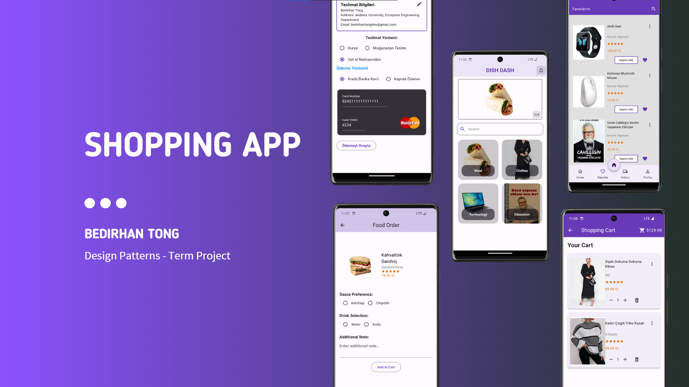
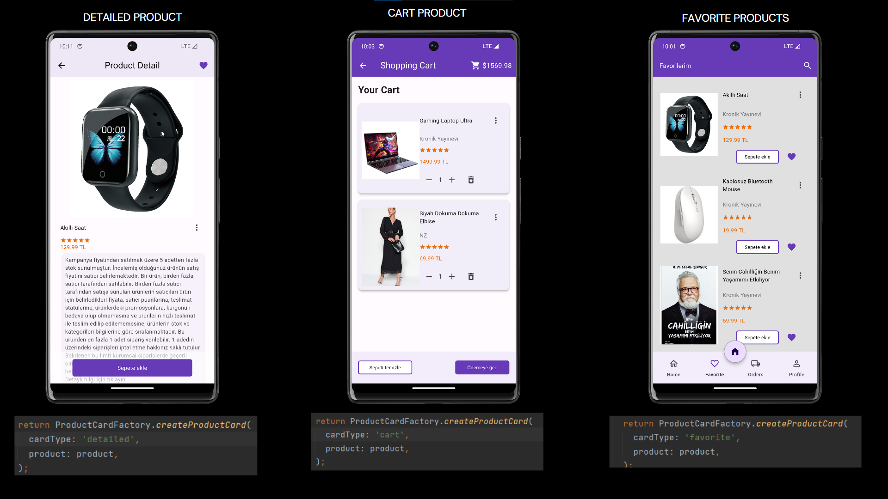
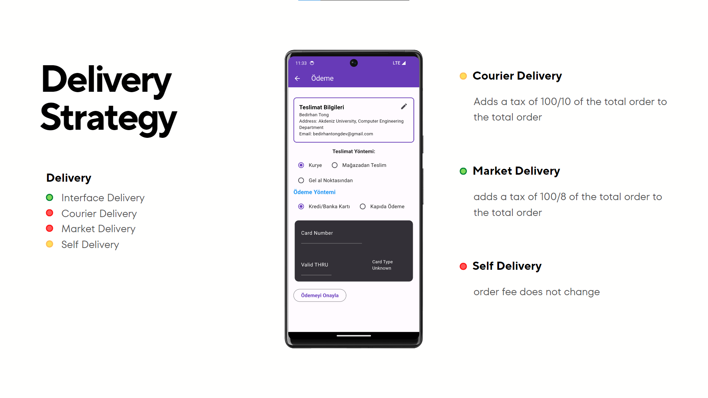
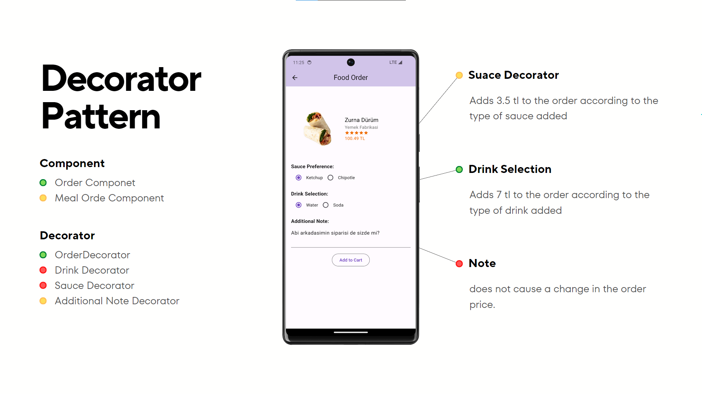

# Dish Dash

- Thanks to the food ordering application, you can easily access the product you want in a dynamic way,
- Understanding which bank card the user enters from the credit / debit card information entered in the order payment section, Offering different delivery method options to the user
- Informing the user about the order status and enabling them to receive live updates,
- To enable the user to track the stock of the product when the user needs a product that is out of stock,
- Providing flexibility with the ability to add extra materials to orders in food orders,
- Entering an extra note or promotional code in the order to provide a discount in the required amount,
- You can add the product you want to the cart and change or update the content of the product you added to the cart,

